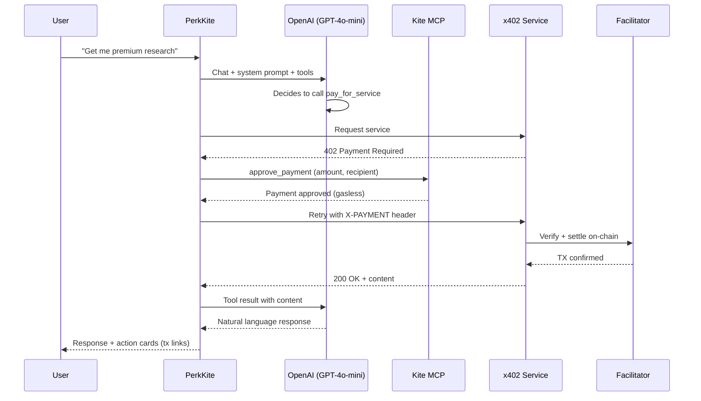

<div align="center">

# PerkKite

### Autonomous AI Agent Launcher on Kite

**Launch AI agents with verifiable on-chain identity, autonomous tool execution, and delegated x402 payments — all gasless on Kite.**

[](https://perkkite.netlify.app)
[](https://gokite.ai)
[](https://perkos.xyz)

</div>

---

## What is PerkKite?

PerkKite is an **agent launcher** built on Kite Agent Passport. It demonstrates the full agentic commerce loop:

1. **Agent authenticates itself** on-chain via Kite MCP
2. **Agent executes autonomously** using an agentic tool-calling loop (OpenAI + 6 tools)
3. **Agent makes x402 payments** — handles HTTP 402, approves payment via Kite Passport, settles on-chain
4. **All gasless** — Account Abstraction wallets, Kite Bundler pays gas
5. **Scoped permissions** — spending rules enforced on-chain by vault smart contracts, revocable sessions

---

## Key Features

### Agent Autonomy
- **Agentic tool loop** — AI calls tools autonomously (up to 5 iterations per message)
- **6 real tools**: identity verification, capability listing, x402 payments, spending rules, vault balance, paid service access
- **No manual wallet clicking** — agent approves payments within spending rules without human intervention

### x402 Payment Protocol
- Full x402 server at `/api/x402` — returns HTTP 402 with payment schema
- Agent handles the complete flow: request → 402 → approve payment → retry with `X-PAYMENT` header → receive content
- Settlement via Pieverse facilitator on Kite Testnet (USDC)

### On-Chain Identity
- Agent verifies its own identity via `get_payer_addr` MCP tool
- Payer addresses linked to Kite Explorer for on-chain verification
- Dashboard shows real-time authentication status

### Scoped Permissions & Revocation
- Configure daily budgets and time windows per agent
- Rules enforced on-chain by vault smart contracts
- Revoke agent sessions from the Dashboard

---

## Architecture

```
User (Wallet) --> PerkKite (Templates + Chat) --> Kite Passport (Identity + Rules) --> AI Agent (MCP Client)
                                                                                            |
                                                                                     x402 Service
                                                                                     402 -> X-PAYMENT -> 200 OK
                                                                                            |
                                                                                     Facilitator (Settlement)
```

### System Flow



### Tech Stack

| Layer | Technology |
|---|---|
| Frontend | Next.js 15, React 19, Tailwind CSS, RainbowKit |
| AI | OpenAI GPT-4o-mini with function calling (agentic loop) |
| Identity | Kite Agent Passport via MCP (Model Context Protocol) |
| Payments | x402 protocol, Pieverse facilitator, USDC settlement |
| Chain | Kite Testnet (Chain ID: 2368), gasless AA wallets |
| Storage | Firebase Firestore |
| Deployment | Netlify |

---

## Quick Start

### Prerequisites

- Node.js >= 22
- pnpm 9+ (`npm install -g pnpm`)

### 1. Clone & Install

```bash
git clone https://github.com/PerkOS-xyz/PerkKite.git
cd PerkKite
pnpm install
```

### 2. Environment Setup

```bash
cp .env.example .env
```

Edit `.env` with your keys:

```env
# Required
OPENAI_API_KEY=sk-...                              # OpenAI API key (server-side)
NEXT_PUBLIC_WALLETCONNECT_PROJECT_ID=...            # WalletConnect project ID

# Kite Agent Passport
KITE_MCP_URL=https://neo.dev.gokite.ai/v1/mcp      # Kite MCP endpoint
NEXT_PUBLIC_KITE_CLIENT_ID=client_agent_...          # Default agent Client ID

# Firebase (for agent persistence)
NEXT_PUBLIC_FIREBASE_API_KEY=...
NEXT_PUBLIC_FIREBASE_AUTH_DOMAIN=...
NEXT_PUBLIC_FIREBASE_PROJECT_ID=...

# Optional - Production Kite (replaces dev MCP)
# KITE_API_KEY=...
```

**Get your Kite Client ID:**
1. Go to [Kite Portal](https://app.gokite.ai/)
2. Create an agent
3. Agents -> Click agent -> MCP Config -> Copy Client ID

### 3. Build & Run

```bash
# Build shared packages first
pnpm build --filter @perkkite/shared --filter @perkkite/kite-sdk

# Start development server
pnpm web
```

Open http://localhost:3000

---

## Demo Walkthrough

### 1. Connect Wallet
Connect with any EVM wallet via RainbowKit. PerkKite defaults to Kite Testnet (Chain ID: 2368).

### 2. Choose a Template
Select from 6 agent templates on the home page (DeFi Trader, NFT Collector, Security Auditor, Research Analyst, Social Manager, DAO Delegate).

### 3. Add Your Kite Agent
In the Dashboard, click **"+ Add Agent"**, paste your Client ID from Kite Portal, and test the MCP connection.

### 4. Chat with Your Agent
Open the chat and try these prompts:

| Prompt | What happens |
|---|---|
| "Show me your identity" | Agent calls `get_agent_identity` via Kite MCP, shows on-chain address |
| "What can you do?" | Agent calls `list_agent_capabilities`, shows all MCP tools |
| "Get me premium research" | Full x402 flow: 402 -> approve payment -> settle -> deliver content |
| "Check my spending rules" | Queries vault spending limits and time windows |
| "Pay 5 USDC to 0x742d..." | Direct x402 payment via Kite Agent Passport |

Each tool call shows **action cards** in the chat with transaction links to [KiteScan](https://testnet.kitescan.ai).

### 5. Configure Spending Rules
In the Dashboard, click "Configure" on any agent to set daily budgets. Rules are enforced on-chain.

### 6. Revoke Access
Click "Revoke Session" to immediately stop an agent from making further payments.

---

## API Routes

| Route | Method | Description |
|---|---|---|
| `/api/chat` | POST | AI chat with agentic tool execution loop |
| `/api/mcp` | GET/POST | MCP JSON-RPC proxy to Kite |
| `/api/agent-info` | GET | Agent identity, payer address, tool count |
| `/api/x402` | POST | x402 payment protocol server (402 -> settle) |
| `/api/vault` | GET/POST | Vault info and spending rule configuration |

---

## Project Structure

```
PerkKite/
  apps/
    web/                      # Next.js frontend + API routes
      src/
        app/
          api/
            chat/route.ts     # AI chat with agentic tool loop
            mcp/route.ts      # MCP JSON-RPC proxy to Kite
            agent-info/       # Agent identity endpoint
            x402/route.ts     # x402 payment protocol server
            vault/route.ts    # Vault management
          page.tsx            # Landing page with templates
          chat/page.tsx       # Chat interface with action cards
          dashboard/page.tsx  # Agent management dashboard
          marketplace/        # Knowledge template marketplace
          agents/new/         # Agent creation wizard
        components/
          Navbar.tsx          # Navigation with RainbowKit
        lib/
          mcp.ts              # Client-side MCP helpers
          mcp-server.ts       # Server-side MCP (for API routes)
          agents.ts           # Firebase agent CRUD
          firebase.ts         # Firebase initialization
  packages/
    kite-sdk/                 # Kite chain SDK
      src/
        client.ts             # KiteClient (x402 settlement)
        aa-client.ts          # KiteAAClient (Account Abstraction)
        passport.ts           # KitePassport (sessions)
        types.ts              # SDK type definitions
    shared/                   # Shared types & constants
      src/
        types/                # Agent, Session, Payment, Skill types
        constants/            # Chain config, runtime definitions
```

---

## Kite Integration Points

| Integration | Endpoint | Purpose |
|---|---|---|
| **Kite MCP** | `neo.dev.gokite.ai/v1/mcp` | Agent identity, tool listing, payment approval |
| **Kite AA SDK** | `gokite-aa-sdk` npm | Account abstraction wallets, gasless transactions |
| **Pieverse Facilitator** | `facilitator.pieverse.io` | x402 payment settlement |
| **Kite Testnet RPC** | `rpc-testnet.gokite.ai` | Chain 2368, on-chain settlement |
| **KiteScan** | `testnet.kitescan.ai` | Transaction and address explorer |

---

## Links

| Resource | URL |
|----------|-----|
| **Live App** | https://perkkite.netlify.app |
| **Kite Portal** | https://app.gokite.ai |
| **Kite Docs** | https://docs.gokite.ai |
| **Agent Passport** | https://docs.gokite.ai/kite-agent-passport/kite-agent-passport |
| **AA SDK** | https://docs.gokite.ai/kite-chain/account-abstraction-sdk |
| **PerkOS** | https://perkos.xyz |

---

## License

MIT

---

<div align="center">

Built for the **Kite AI Hackathon**

Powered by [PerkOS](https://perkos.xyz) x [Kite](https://gokite.ai)

</div>
