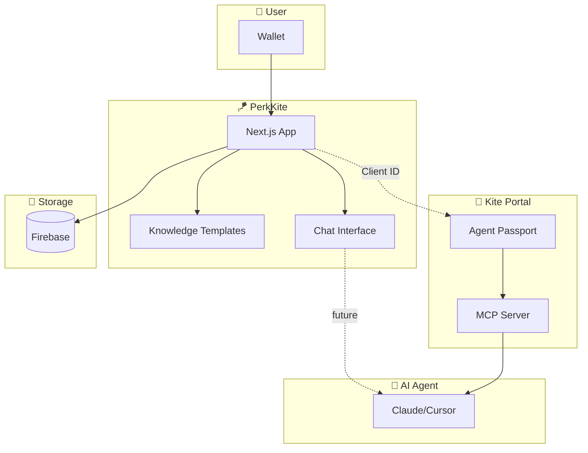
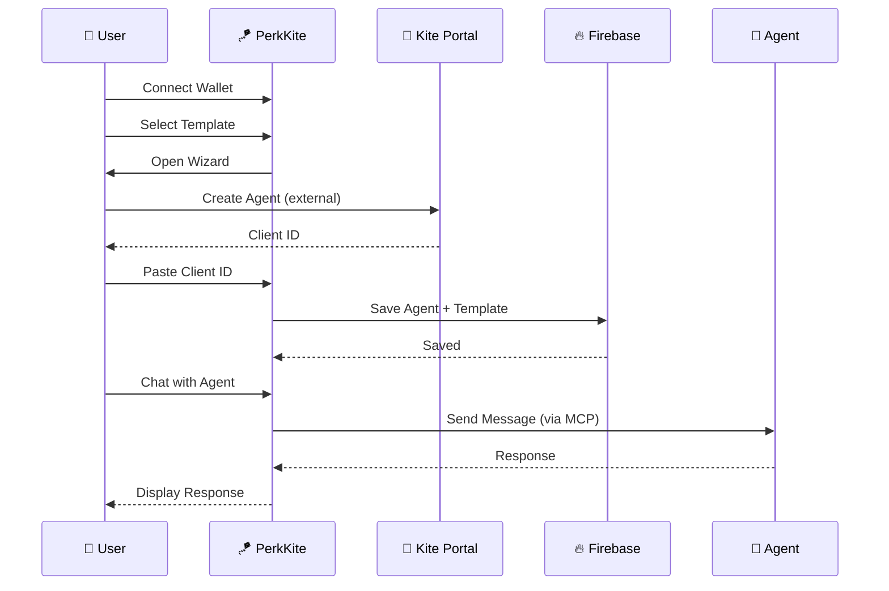
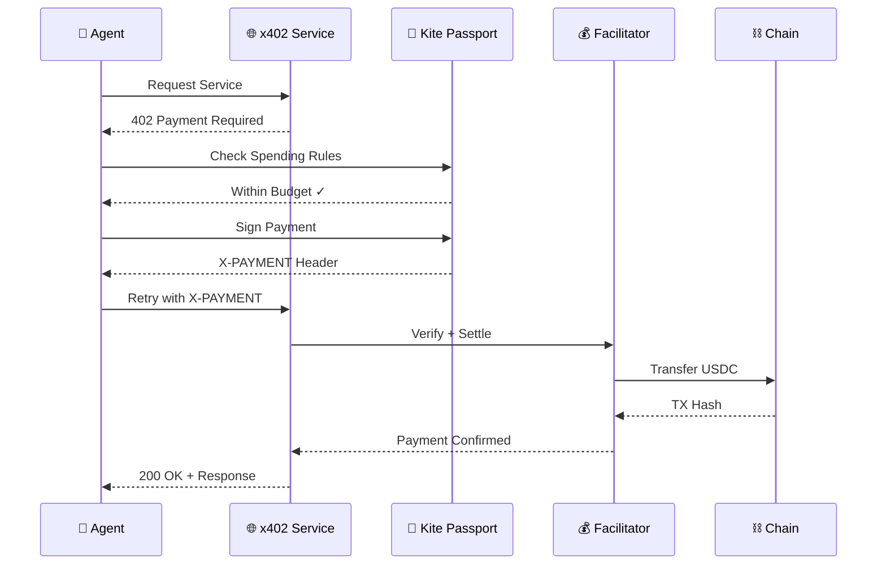

<div align="center">

# 🪁 PerkKite

### Knowledge Marketplace for Kite Agents

**Customize your AI agents with templates, chat interface, and x402 payments powered by Kite Agent Passport.**

[](https://perkkite.netlify.app)
[](https://gokite.ai)
[](https://perkos.xyz)

</div>

---

## 🎯 What is PerkKite?

PerkKite is a **Knowledge Marketplace** for AI agents on Kite Agent Passport. It allows users to:

1. **Connect Wallet** — Authenticate with your wallet
2. **Link Kite Agent** — Paste your Client ID from Kite Portal
3. **Choose Templates** — Pre-built knowledge packs for DeFi, NFTs, Security, etc.
4. **Chat with Agent** — Talk to your agent directly through PerkKite

**Kite Portal** manages identity & payments → **PerkKite** customizes knowledge & provides chat UI.

---

## ✨ Features

- 🔐 **Wallet Connect** — RainbowKit + wagmi with Kite Testnet
- 📚 **Knowledge Templates** — 6 categories: DeFi, NFT, Research, Security, Social, Governance
- 🤖 **Agent Dashboard** — Manage multiple Kite agents per wallet
- 💬 **Chat Interface** — Talk to your agents (coming soon)
- 🔥 **Firebase Persistence** — Agents stored by wallet address
- ⚡ **x402 Native** — Built for Kite's payment protocol

---

## 📦 Agent Templates

| Template | Description | Price |
|----------|-------------|-------|
| 📈 **DeFi Trader** | Yield optimization, swaps, portfolio tracking | Free |
| 🖼️ **NFT Collector** | Floor tracking, rarity analysis, marketplace | Free |
| 🔬 **Research Analyst** | Protocol docs, tokenomics, market research | Free |
| 🛡️ **Security Auditor** | Contract analysis, rug detection, risk scoring | 10 USDC |
| 📱 **Social Manager** | Twitter monitoring, Farcaster, community | 5 USDC |
| 🏛️ **DAO Delegate** | Governance proposals, voting, delegate tracking | 5 USDC |

---

## 🏗️ Architecture

### System Overview



### User Flow



### x402 Payment Flow



---

## 🚀 Quick Start

### Prerequisites

- Node.js 22+
- pnpm 9+ (`npm install -g pnpm`)

### 1. Clone & Install

```bash
git clone https://github.com/PerkOS-xyz/PerkKite.git
cd PerkKite
pnpm install
```

### 2. Environment Setup

```bash
cp .env.example .env.local
```

Required env vars (set in Netlify for production):

```env
# Firebase
NEXT_PUBLIC_FIREBASE_API_KEY=...
NEXT_PUBLIC_FIREBASE_AUTH_DOMAIN=...
NEXT_PUBLIC_FIREBASE_PROJECT_ID=...

# Kite
KITE_CLIENT_ID=your_client_agent_id
KITE_MCP_URL=https://neo.dev.gokite.ai/v1/mcp
```

### 3. Run Development

```bash
pnpm dev
```

Open http://localhost:3000

---

## 📁 Project Structure

```
PerkKite/
├── apps/
│   ├── web/                 # Next.js 15 frontend
│   │   ├── src/app/         # Pages (App Router)
│   │   ├── src/components/  # React components
│   │   └── src/lib/         # Firebase, agents
│   └── api/                 # Express backend (x402)
├── packages/
│   ├── shared/              # Types & constants
│   └── kite-sdk/            # Kite x402 SDK
└── README.md
```

---

## 🔗 Links

| Resource | URL |
|----------|-----|
| **Live App** | https://perkkite.netlify.app |
| **Kite Portal** | https://x402-portal-eight.vercel.app |
| **Kite Docs** | https://docs.gokite.ai/kite-agent-passport |
| **PerkOS** | https://perkos.xyz |

---

## 🛠️ Tech Stack

- **Frontend:** Next.js 15, React 19, Tailwind CSS
- **Auth:** RainbowKit + wagmi
- **Database:** Firebase Firestore
- **Payments:** Kite Agent Passport + x402
- **Deploy:** Netlify

---

## 📄 License

MIT

---

<div align="center">

Built for **ETH Denver 2026** 🏔️

Powered by [PerkOS](https://perkos.xyz) × [Kite](https://gokite.ai)

</div>
