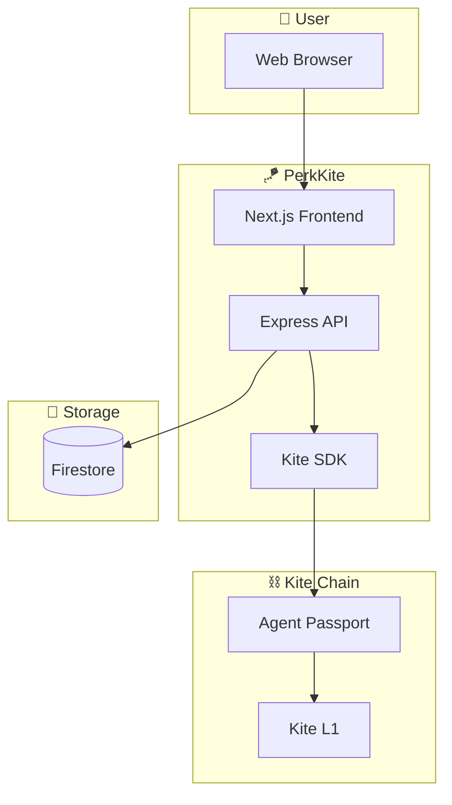
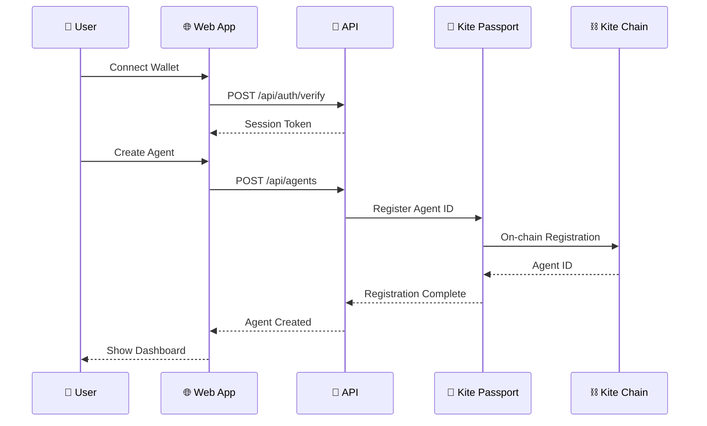
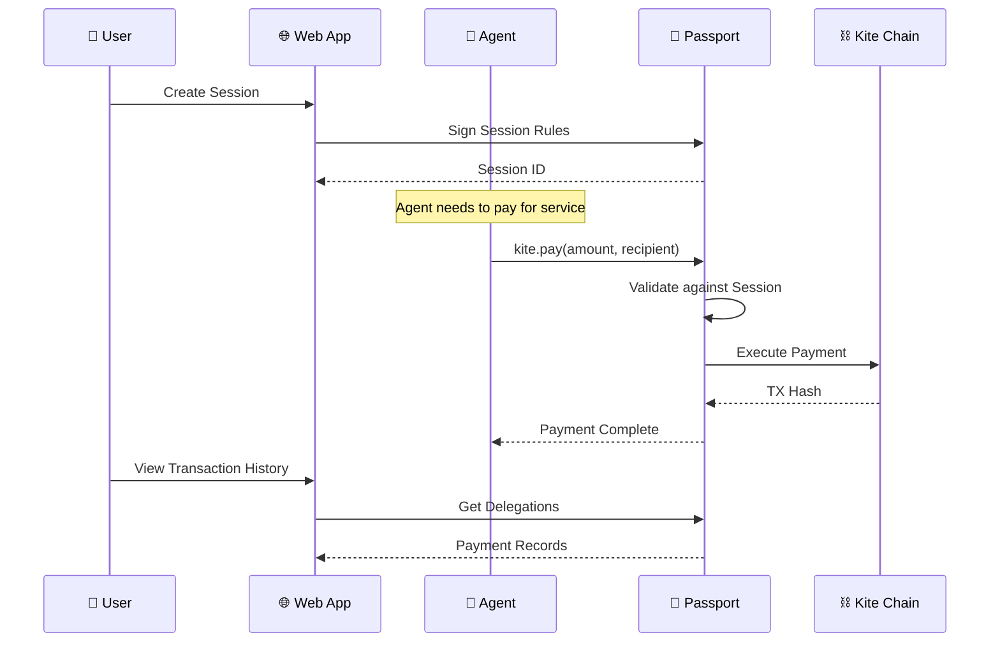
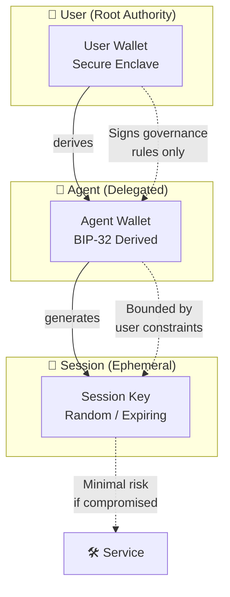

<div align="center">

# 🪁 PerkKite

### Spark for Kite — Agent Launcher on Kite Agent Passport

**Launch AI agents with verifiable identity, delegated payments, and programmable governance.**

[](https://gokite.ai)
[](https://perkos.xyz)

</div>

---

## Features

- 🔐 **Wallet Auth** — Connect with RainbowKit + wagmi
- 🎫 **Kite Passport** — Verifiable agent identity
- 💰 **Delegated Payments** — Sessions with spending rules
- 🛠️ **MCP Integration** — `kite.pay()` for any agent
- 📋 **Skills Management** — YAML-based skill definitions

---

## Architecture

### System Overview



### Agent Creation Flow



### Payment Flow (Kite Passport)



### Identity Hierarchy



---

## Prerequisites

- **Node.js** 22+ 
- **pnpm** 9+ (`npm install -g pnpm`)

---

## Quick Start

### 1. Clone the repo

```bash
git clone https://github.com/PerkOS-xyz/PerkKite.git
cd PerkKite
```

### 2. Install dependencies

```bash
pnpm install
```

### 3. Set up environment

```bash
cp .env.example .env.local
```

Edit `.env.local` with your credentials:

```env
# Kite Chain
NEXT_PUBLIC_KITE_RPC_URL=https://rpc.testnet.gokite.ai
NEXT_PUBLIC_KITE_CHAIN_ID=2368

# Kite Agent Passport (get from https://gokite.ai)
KITE_API_KEY=your_kite_api_key
KITE_API_URL=https://api.gokite.ai

# WalletConnect (get from https://cloud.walletconnect.com)
NEXT_PUBLIC_WALLETCONNECT_PROJECT_ID=your_project_id

# API
API_PORT=3001
```

### 4. Run development servers

```bash
# Run all apps (web + api)
pnpm dev

# Or run individually:
pnpm web   # Frontend only (http://localhost:3000)
pnpm api   # Backend only (http://localhost:3001)
```

### 5. Open the app

- **Frontend:** http://localhost:3000
- **API:** http://localhost:3001/health

---

## Available Scripts

| Command | Description |
|---------|-------------|
| `pnpm dev` | Start all apps in dev mode |
| `pnpm build` | Build all apps for production |
| `pnpm web` | Start frontend only |
| `pnpm api` | Start backend only |
| `pnpm lint` | Run ESLint |
| `pnpm clean` | Clean build artifacts |

---

## Project Structure

```
perkkite/
├── apps/
│   ├── web/           # Next.js 15 frontend
│   │   ├── src/app/   # Pages (App Router)
│   │   └── ...
│   └── api/           # Express backend
│       ├── src/routes/  # API endpoints
│       └── ...
├── packages/
│   ├── shared/        # Shared types & constants
│   └── kite-sdk/      # Kite Passport SDK wrapper
└── docs/              # Documentation
```

---

## API Endpoints

| Method | Endpoint | Description |
|--------|----------|-------------|
| GET | `/health` | Health check |
| POST | `/api/auth/verify` | Verify wallet signature |
| POST | `/api/auth/session` | Create auth session |
| GET | `/api/agents` | List agents |
| POST | `/api/agents` | Create agent |
| GET | `/api/sessions` | List Passport sessions |
| POST | `/api/sessions` | Create Passport session |

---

## Tech Stack

- **Frontend:** Next.js 15, React 19, Tailwind CSS
- **Backend:** Express, TypeScript
- **Auth:** RainbowKit + wagmi (coming soon)
- **Database:** Firebase Firestore
- **Payments:** Kite Agent Passport

---

## Links

- [Kite Docs](https://docs.gokite.ai)
- [Kite Agent Passport](https://docs.gokite.ai/kite-agent-passport)
- [PerkOS](https://perkos.xyz)

---

Built for ETH Denver 2026 🏔️ — Powered by PerkOS × Kite
